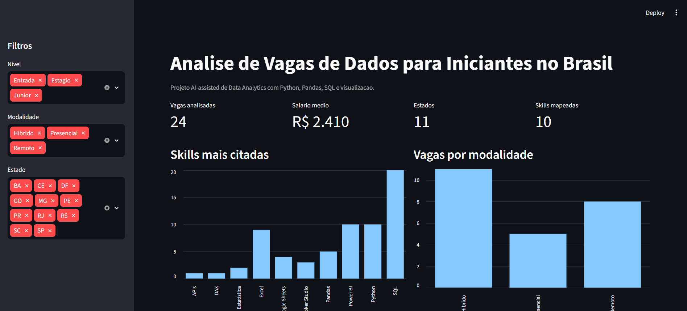

# Analise de Vagas de Dados para Iniciantes no Brasil

Projeto de Data Analytics para analisar vagas de entrada na area de dados no Brasil, identificando as habilidades, ferramentas, modalidades de trabalho e faixas salariais mais recorrentes.

Este projeto faz parte do meu portfolio de transicao para a area de dados e foi desenvolvido com abordagem **AI-assisted development**, usando IA generativa como apoio para acelerar codigo, documentacao e organizacao tecnica.

> Status: versao 0.1 funcional com base simulada. A proxima etapa sera substituir ou complementar os dados com vagas reais coletadas de fontes publicas ou exportacoes manuais.

## Preview



## Sumario

- [Objetivo](#objetivo)
- [Perguntas de negocio](#perguntas-de-negocio)
- [Principais resultados](#principais-resultados)
- [Tecnologias utilizadas](#tecnologias-utilizadas)
- [Estrutura do projeto](#estrutura-do-projeto)
- [Como executar](#como-executar)
- [Metodologia AI-assisted](#metodologia-ai-assisted)
- [Aprendizados](#aprendizados)
- [Roadmap](#roadmap)

## Objetivo

Quem busca o primeiro estagio ou vaga junior em dados costuma encontrar muitas exigencias diferentes: SQL, Python, Excel, Power BI, estatistica, cloud, machine learning e outras ferramentas.

Este projeto transforma essa incerteza em uma analise orientada por dados:

**Quais habilidades e ferramentas aparecem com mais frequencia em vagas de dados para iniciantes no Brasil?**

A proposta e criar uma base analitica para ajudar pessoas iniciantes, como eu, a priorizar estudos e entender melhor o mercado de entrada em dados.

## Perguntas de negocio

- Quais skills sao mais citadas nas vagas?
- Quais ferramentas aparecem com maior frequencia?
- Quais modalidades aparecem mais: remoto, hibrido ou presencial?
- Quais estados concentram mais oportunidades?
- Como a media salarial varia por nivel?
- Quais habilidades uma pessoa iniciante deveria priorizar?

## Principais resultados

Na base simulada da versao inicial, foram analisadas **24 vagas** de estagio, entrada e junior em dados.

Resumo dos achados:

- **SQL** apareceu em 20 das 24 vagas analisadas.
- **Python** e **Power BI** apareceram em 10 vagas cada.
- **Excel** apareceu em 9 vagas.
- As modalidades mais comuns foram **hibrido** e **remoto**.
- A media salarial simulada foi de **R$ 2.410**.

Top skills identificadas:

| Skill | Mencoes |
| --- | ---: |
| SQL | 20 |
| Python | 10 |
| Power BI | 10 |
| Excel | 9 |
| Pandas | 5 |
| Google Sheets | 4 |
| Looker Studio | 3 |

Com base nesses resultados, a ordem inicial de estudo sugerida e:

1. SQL
2. Excel ou Google Sheets
3. Power BI
4. Python com Pandas
5. Estatistica descritiva

O relatorio completo esta em [`reports/resumo_executivo.md`](reports/resumo_executivo.md).

## Tecnologias utilizadas

- **Python** para automacao do pipeline
- **Pandas** para tratamento e analise dos dados
- **SQLite** para armazenamento local
- **SQL** para consultas analiticas
- **Streamlit** para dashboard interativo
- **Git e GitHub** para versionamento e publicacao

## Estrutura do projeto

```text
.
|-- dashboard/
|   `-- app.py
|-- data/
|   |-- processed/
|   |   |-- vagas_dados.db
|   |   |-- vagas_skills.csv
|   |   `-- vagas_tratadas.csv
|   `-- raw/
|       `-- vagas_dados_br.csv
|-- queries/
|   |-- 01_top_skills.sql
|   |-- 02_vagas_por_modalidade.sql
|   |-- 03_vagas_por_estado.sql
|   `-- 04_skills_por_nivel.sql
|-- reports/
|   `-- resumo_executivo.md
|-- src/
|   |-- analyze.py
|   |-- load_sqlite.py
|   |-- run_pipeline.py
|   `-- transform.py
|-- README.md
`-- requirements.txt
```

## Como executar

Clone o repositorio:

```bash
git clone https://github.com/luthhop/analise-vagas-dados-brasil.git
cd analise-vagas-dados-brasil
```

Crie e ative um ambiente virtual:

```bash
python -m venv .venv
.venv\Scripts\activate
```

Instale as dependencias:

```bash
pip install -r requirements.txt
```

Execute o pipeline:

```bash
python src/run_pipeline.py
```

O pipeline gera:

- `data/processed/vagas_tratadas.csv`
- `data/processed/vagas_skills.csv`
- `data/processed/vagas_dados.db`
- `reports/resumo_executivo.md`

Abra o dashboard:

```bash
streamlit run dashboard/app.py
```

## Metodologia AI-assisted

Este projeto foi desenvolvido com apoio de IA generativa como parceira de desenvolvimento.

A IA foi usada para:

- estruturar o escopo inicial do projeto;
- criar primeiras versoes dos scripts Python;
- sugerir organizacao de pastas;
- apoiar a documentacao;
- propor perguntas analiticas e visualizacoes;
- revisar erros durante a execucao.

A conducao humana ficou responsavel por:

- definir o problema;
- escolher a narrativa do projeto;
- validar se as analises faziam sentido;
- revisar os resultados;
- decidir os proximos passos;
- conectar o projeto com objetivos de carreira em dados.

## Aprendizados

Este projeto pratica conceitos importantes para uma primeira oportunidade em dados:

- leitura e organizacao de dados em CSV;
- limpeza e padronizacao de textos;
- extracao de habilidades a partir de descricoes de vagas;
- criacao de tabelas tratadas para analise;
- carga de dados em banco SQLite;
- consultas SQL para responder perguntas de negocio;
- geracao de relatorio executivo;
- criacao de dashboard interativo;
- documentacao de projeto para portfolio.

## Roadmap

- [x] Criar base inicial de vagas
- [x] Tratar dados com Python e Pandas
- [x] Extrair skills das descricoes
- [x] Gerar banco SQLite
- [x] Criar consultas SQL
- [x] Gerar relatorio executivo
- [x] Criar dashboard Streamlit
- [ ] Substituir ou complementar a base simulada com dados reais
- [ ] Adicionar notebook de EDA
- [ ] Criar visualizacoes para o README
- [ ] Publicar post no LinkedIn com os principais insights
- [ ] Evoluir para dashboard em Power BI

## Observacao sobre os dados

A base atual e simulada e foi criada para desenvolver a estrutura inicial do projeto, validar o pipeline e demonstrar o fluxo analitico. Antes de usar os resultados como retrato do mercado, a base precisa ser substituida ou complementada por dados reais.
